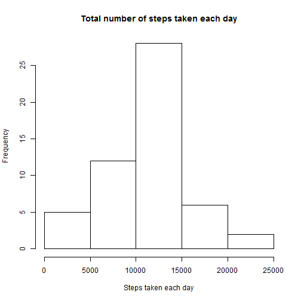
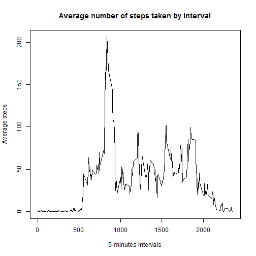
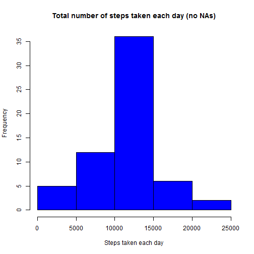

First of all let's load the needed libraries and set the options' default:


```r
library(tidyr)
library(knitr)
library(lattice)

opts_chunk$set(echo = TRUE)
```

## Loading and preprocessing the data

Unzip the _activity.zip_ file in the _data_ folder:


```r
zip_file <- "activity.zip"
data_folder <- "data"
if (dir.exists(data_folder)) {
  unlink(data_folder, recursive = TRUE)
}
unzip(zip_file, exdir = data_folder)
```

read the comma-separated-value file named _activity.csv_ from _data_ folder:


```r
csv_file <- "activity.csv"
csv_data <- read.csv(file.path(data_folder, csv_file), header = TRUE, sep = ",")
```

change date column format:


```r
csv_data$date <- as.Date(csv_data$date, "%Y-%m-%d")
```

## What is mean total number of steps taken per day?

For this part of the assignment, we can ignore the missing values in the dataset:


```r
csv_data2 <- csv_data[!is.na(csv_data$steps),]
```

let's group the steps by day and calculate the total number of steps taken per day:


```r
tot_steps_day <- with(csv_data2, tapply(steps, date, sum))
head(tot_steps_day)
```

```
## 2012-10-02 2012-10-03 2012-10-04 2012-10-05 2012-10-06 2012-10-07 
##        126      11352      12116      13294      15420      11015
```

Here's the histogram of the total number of steps taken each day:


```r
hist(tot_steps_day, xlab = "Steps taken each day", main = "Total number of steps taken each day")
```



The mean and median of the total number of steps taken per day are:


```r
mean(tot_steps_day)
```

```
## [1] 10766.19
```

```r
median(tot_steps_day)
```

```
## [1] 10765
```

## What is the average daily activity pattern?

Here's a time series plot of the 5-minute interval (x-axis) and the average number of steps taken, averaged across all days (y-axis):


```r
csv_data2 <- csv_data[!is.na(csv_data$steps),]
ints <- unique(csv_data2$interval)
ave_steps_interval <- with(csv_data2, tapply(steps, interval, mean))
plot(ints, ave_steps_interval, type = "l", 
     xlab = "5-minutes intervals", 
     ylab = "Average steps", 
     main = "Average number of steps taken by interval" )
```



This is the 5-minute interval, on average across all the days in the dataset, that contains the maximum number of steps:


```r
max_ave_steps <- match(max(ave_steps_interval), ave_steps_interval)
ints[max_ave_steps]
```

```
## [1] 835
```

## Imputing missing values

The total number of missing values in the dataset (i.e. the total number of rows with NAs) is:


```r
sum(is.na(csv_data$steps))
```

```
## [1] 2304
```

```r
na_perc <- mean(is.na(csv_data$steps)) * 100
```

which is the 13.1147541%.

Let's fill all the NA value with the mean of the interval:


```r
csv_data2 <- data.frame(csv_data)
na_index <- is.na(csv_data2$steps)
csv_data2$steps[na_index] <- ave_steps_interval[as.character(csv_data2$interval[na_index])]
head(csv_data2)
```

```
##       steps       date interval
## 1 1.7169811 2012-10-01        0
## 2 0.3396226 2012-10-01        5
## 3 0.1320755 2012-10-01       10
## 4 0.1509434 2012-10-01       15
## 5 0.0754717 2012-10-01       20
## 6 2.0943396 2012-10-01       25
```

Here's the histogram of the total number of steps taken each day:


```r
tot_steps_day2 <- with(csv_data2, tapply(steps, date, sum))
hist(tot_steps_day2, xlab = "Steps taken each day", 
     main = "Total number of steps taken each day (no NAs)", col = c("blue"))
```



The mean and median of the total number of steps taken per day are:


```r
mean(tot_steps_day2)
```

```
## [1] 10766.19
```

```r
median(tot_steps_day2)
```

```
## [1] 10766.19
```

These values don't differ much from the estimates from the first part of the assignment. In fact the mean is the same and the variation of the two medians is 1%.

## Are there differences in activity patterns between weekdays and weekends?

Let's create a new factor variable in the dataset with two levels - "weekday" and "weekend" indicating whether a given date is a weekday or weekend day:


```r
Sys.setlocale("LC_ALL","English")
```

```
## [1] "LC_COLLATE=English_United States.1252;LC_CTYPE=English_United States.1252;LC_MONETARY=English_United States.1252;LC_NUMERIC=C;LC_TIME=English_United States.1252"
```

```r
csv_data2$day_type <- ifelse(weekdays(csv_data2$date) == "Saturday" | weekdays(csv_data2$date) == "Sunday", "weekend", "weekday")
```

Here's the plot containing a time series plot of the 5-minute interval (x-axis) and the average number of steps taken, averaged across all weekday days or weekend days (y-axis):


```r
ave_steps_interval_day_type <- aggregate(steps ~ interval + day_type, 
                                         csv_data2, mean)
xyplot(steps ~ interval | day_type, ave_steps_interval_day_type, type = "l",
       layout = c(1, 2), xlab = "Interval", ylab = "Number of steps")
```


